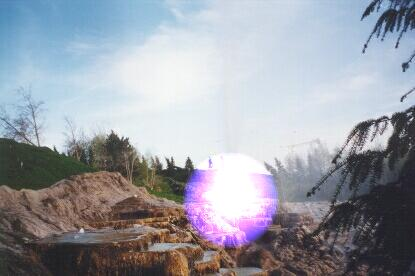



## Light Effects

### Description

"DrawLight" is a function that I wrote because I wanted to add lightning effects to my game, if it was possible. Guess what, it is -- and here's the proof! Just have a look at that screenshot; it was made with my program, I didn't edit it with any other graphics program! :)

It draws a light in any picture, but it's faster than most ways to achive this (because I used the circle's core equation instead of the Circle function). Also, you can choose the color that will be used in the effect, instead of a simple white light!

As a "bonus", included is the code to draw a circle (its core equation), and something I did to remind people to vote me (because I noticed that 290 people had downloaded the Translucency effect, but only 2 had voted!) -- and automatically opens your browser and orders it to go to Planet Source-Code (it asks you if you want before doing it).

And there's no need for backbuffers, as the light uses a very cool effect while loading ;)

I'm working now on a way of doing this, but instead of a circle, you can use a mask! I also wanna make a variation of this for lasers (same way as the mask, but automatically draws the mask with a line).
 
### More Info
 
You don't need to know nothing at all before using. It can even teach you something instead: about using equations with loops, messing with the RGB values of each pixel to get some nice effects, and how basic algorythms for graphics work.

             |
---                |---
**Submitted On**   |2000-07-22 19:17:50
**By**             |[Jotaf98](https://github.com/Planet-Source-Code/PSCIndex/blob/master/ByAuthor/jotaf98.md)
**Level**          |Intermediate
**User Rating**    |4.7 (118 globes from 25 users)
**Compatibility**  |VB 3\.0, VB 4\.0 \(16\-bit\), VB 4\.0 \(32\-bit\), VB 5\.0, VB 6\.0, VB Script, ASP \(Active Server Pages\) 
**Category**       |[Graphics](https://github.com/Planet-Source-Code/PSCIndex/blob/master/ByCategory/graphics__1-46.md)
**World**          |[Visual Basic](https://github.com/Planet-Source-Code/PSCIndex/blob/master/ByWorld/visual-basic.md)
**Archive File**   |[CODE\_UPLOAD80277222000\.zip](https://github.com/Planet-Source-Code/jotaf98-light-effects__1-9862/archive/master.zip)

